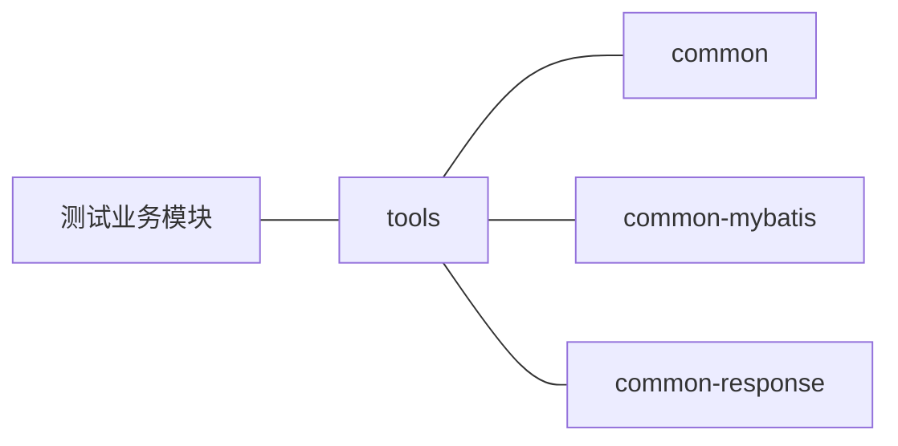

# spring-cloud-test代码说明

## 修订记录

| 版本 | 作者 | 日期       | 说明 |
| ---- | ---- | ---------- | ---- |
| V1.0 | Lim  | 2020-11-17 | 初版 |


------

## 目录

[TOC]

------

## 前言

​	本项目用于个人测试spring boot、spring cloud 相关功能

## 架构设计



说明：

- 测试业务模块：各测试功能的模块，每个功能/组件一个模块，若为springCloud组件，则建立一个二级模块，并再细分三级模块
- tools：二级模块，用于存放各种通用配置及工具类。可提供给正式应用。
- common：三级模块，Java工具类，和spring无关，可提供给java项目使用
- common-mybatis：三级模块，mybtis、mybatis-plus相关配置，引入此模块即可使用mybatis-plus相关功能
- common-response：三级模块，对返回结果封装、程序中断等功能

## 测试业务模块说明

### doc

​	说明：相关文档/附件

### base

​	说明：基础springBoot项目，用于快速新建模块

### http

​	说明：http请求测试，包括不同形式的参数接收、校验等

### springcache

​	说明：通过注解操作redis，基于jiedis实现，可根据keyName设置过期时间，但无法给每个key设置独立的过期时间

### jetcache

​	说明：alibaba jetcache功能，通过注解实现redis操作(lettuce实现)

### mybatisplus

​	说明：mybatis、mybatis-plus功能测试，常用的crud、分页查询、事务等操作

- role：枚举

- org：自定义逻辑删除字段

- user：常用CRUD

- 参考链接：[mybatis](https://mybatis.org/mybatis-3/zh/dynamic-sql.html)  [mybatis plus](https://mybatis.plus/)


### swagger

​	说明：swagger3测试，基于注解生成接口文档。代码侵入性强，不建议使用，推荐yapi

### activiti(未完成)

​	说明：流程引擎相关功能，基于activiti7。

### nacos-config-client

​	说明：nacos配置中心测试，需搭配nacos服务(独立部署)使用，可动态更新配置

### nacos-discover-clent

​	说明：nacos注册中心测试，需搭配nacos服务(独立部署)使用，实现了服务注册、服务发现、负载均衡功能

### lettuce

​	说明：使用redisTemplate操作redis，基于lettuce实现。

### amqp

​	说明：RabbitMq相关操作，包含写入(多优先级)、监听功能

### junit

​	说明：junit单元测试，包括controller、service、javaBean测试

### mybatis-generator

​	说明：mybatis代码生成器，可生成controller、service、mapper、entity、xml

## 数据库说明

- 连接信息

  ```yaml
      url: jdbc:p6spy:mysql://127.0.0.1:3306/test?characterEncoding=utf8&serverTimezone=Asia/Shanghai&useSSL=false&zeroDateTimeBehavior=convertToNull
      username: root
      password: 123456
  ```

- 基于mysql5.7

## 附件

- /doc/postman_environment.json：可导入postman，对应测试的环境参数
- /doc/postman_collection.json：可导入postman，所有模块的测试接口
- /doc/test.sql：测试相关数据库